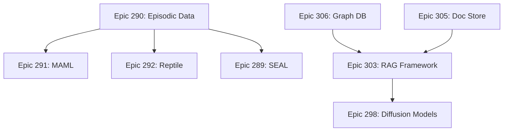

# Issue #293: Junior Developer Implementation Guide
## AiDotNet Roadmap: High-Impact Backlog and Tracking

---

## Table of Contents
1. [Understanding the Roadmap](#understanding-the-roadmap)
2. [Understanding Project Management](#understanding-project-management)
3. [Theme-Based Organization](#theme-based-organization)
4. [Implementation Prioritization](#implementation-prioritization)
5. [Epic and User Story Structure](#epic-and-user-story-structure)
6. [Tracking and Reporting](#tracking-and-reporting)
7. [Step-by-Step Guide](#step-by-step-guide)

---

## Understanding the Roadmap

### What Is a Roadmap?

A **software roadmap** is a strategic plan that defines the vision, direction, and progress of a project over time. For AiDotNet, it organizes features into logical themes and tracks their implementation status.

### Purpose of This Issue

Issue #293 serves as the **central living document** that:
- Organizes high-impact features into themes
- Links to detailed implementation plans (epics)
- Tracks progress across the entire project
- Provides visibility for contributors and maintainers

### Key Components

1. **Themes**: Broad areas of functionality (e.g., RAG, Meta-Learning)
2. **Epics**: Large features within themes (e.g., Graph Database, MAML Algorithm)
3. **User Stories**: Granular, actionable tasks within epics (tracked as separate issues)
4. **Status**: Current state (Ready for Development, Backlog, In Progress, Complete)

---

## Understanding Project Management

### Agile Methodology

AiDotNet uses **Agile principles**:
- Break large features into small, deliverable units
- Work iteratively with continuous improvement
- Prioritize based on value and dependencies
- Track progress transparently

### GitHub Project Tools

**GitHub Issues**: Individual tasks with detailed descriptions
- Example: Issue #290 (Episodic Data Abstractions)
- Contains acceptance criteria, technical details, and checklist

**GitHub Projects**: Visual board organizing issues
- Link: https://github.com/users/ooples/projects/7
- Columns: Backlog, In Progress, In Review, Done

**GitHub Milestones**: Group related issues for release planning
- Link: https://github.com/ooples/AiDotNet/milestones
- Example: "v0.1.0 - Meta-Learning Release"

### Issue Relationships

```
Roadmap (Issue #293)
├── Theme 1: RAG
│   ├── Epic #306: Graph Database
│   │   ├── User Story #XXX: Implement Graph Interface
│   │   ├── User Story #YYY: Add Persistence Layer
│   │   └── User Story #ZZZ: Create Query API
│   ├── Epic #305: Document Store
│   └── Epic #303: RAG Framework
├── Theme 2: Diffusion Models
│   └── Epic #298: Advanced Schedulers
└── Theme 3: Meta-Learning
    ├── Epic #290: Episodic Data Abstractions
    ├── Epic #289: SEAL Algorithm
    ├── Epic #291: MAML Algorithm
    └── Epic #292: Reptile Algorithm
```

---

## Theme-Based Organization

### Current Themes

#### Theme 1: Retrieval-Augmented Generation (RAG) & Search

**Goal**: Build state-of-the-art RAG framework with persistent storage.

**Why Important**:
- RAG is critical for modern AI applications (chatbots, search, Q&A)
- Enables large-scale document retrieval and generation
- Foundation for knowledge-intensive AI systems

**Components**:
1. **Graph Database (Epic #306)**
   - Store and query knowledge graphs
   - Support complex relationships between entities
   - Persistent on-disk storage

2. **Document Store (Epic #305)**
   - Store and index documents for retrieval
   - Full-text search capabilities
   - Efficient storage and retrieval

3. **RAG Framework (Epic #303)**
   - Tie together retrieval and generation
   - Builder pattern integration
   - End-to-end examples and benchmarks

**Status**: Ready for Development

#### Theme 2: Advanced Generative AI (Diffusion Models)

**Goal**: Comprehensive diffusion model suite for image generation.

**Why Important**:
- Diffusion models power modern image generation (Stable Diffusion, DALL-E)
- Growing demand for on-device generative AI
- Showcase cutting-edge AI techniques in .NET

**Components**:
1. **Advanced Schedulers (Epic #298 Phase 1)**
   - DDIM, PNDM, DPM-Solver schedulers
   - Control noise scheduling in diffusion process
   - Performance and quality improvements

2. **U-Net and VAE (Epic #298 Phase 2)**
   - U-Net architecture for denoising
   - Variational Autoencoder for latent space
   - Core building blocks for diffusion

3. **Latent Diffusion Pipeline (Epic #298 Phase 3)**
   - Complete text-to-image pipeline
   - Integrate all components
   - Production-ready generation

**Status**: Ready for Development

#### Theme 3: Meta-Learning

**Goal**: Enable models that learn new tasks rapidly from few examples.

**Why Important**:
- Critical for few-shot learning scenarios (limited training data)
- Powers adaptive AI systems
- Research frontier in machine learning

**Components**:
1. **Episodic Data Abstractions (Epic #290)**
   - N-way K-shot data loading
   - Support and query set structure
   - Foundation for meta-learning training

2. **SEAL Algorithm (Epic #289)**
   - Self-supervised + active learning approach
   - State-of-the-art few-shot performance
   - Novel meta-learning technique

3. **MAML Algorithm (Epic #291)**
   - Model-Agnostic Meta-Learning
   - Classic meta-learning baseline
   - Two-level optimization

4. **Reptile Algorithm (Epic #292)**
   - Simplified meta-learning approach
   - More efficient than MAML
   - Easier to implement and tune

**Status**: Backlog (after RAG and Diffusion)

#### Theme 4: Core Infrastructure & Productionization

**Goal**: Make library robust, efficient, and production-ready.

**Why Important**:
- Enables real-world deployment
- Performance and scalability
- Developer experience and ease of use

**Components**:
1. **Datasets and DataLoaders (Epic #282)**
   - ImageFolderLoader, AudioLoader
   - Common data formats
   - Streamlined data ingestion

2. **Training Recipes & Config System (Epic #283)**
   - YAML configuration
   - Configurable trainer
   - Reproducible training

3. **Inference Optimizations (Epic #277)**
   - KV cache for transformers
   - Reduce latency for generation
   - Memory efficiency

4. **Quantization (Epic #278)**
   - Post-training quantization (PTQ)
   - Float32 to Int8 conversion
   - Smaller models, faster inference

5. **ONNX Export & Runtime (Epic #280)**
   - Export to ONNX format
   - Cross-platform deployment
   - Hardware acceleration (DirectML)

**Status**: Backlog (ongoing as needed)

---

## Implementation Prioritization

### Priority Framework

**Priority 1: Core Value Features**
- Directly enable key use cases
- High user demand
- Foundation for other features

**Examples**: RAG Framework, Meta-Learning Basics

**Priority 2: Differentiation Features**
- Unique capabilities
- Competitive advantage
- Advanced research techniques

**Examples**: Diffusion Models, SEAL Algorithm

**Priority 3: Infrastructure & Polish**
- Developer experience
- Performance optimization
- Production readiness

**Examples**: ONNX Export, Config System, Quantization

### Dependency Analysis

**Must Implement First** (Blockers):
1. Episodic Data Abstractions (Epic #290) → Blocks all meta-learning algorithms
2. Graph Database (Epic #306) → Blocks Graph RAG features
3. Document Store (Epic #305) → Blocks RAG pipeline finalization

**Can Implement in Parallel**:
- Diffusion Models (Theme 2) - Independent of RAG and Meta-Learning
- Infrastructure (Theme 4) - Cross-cutting, can be added incrementally

**Should Implement Last** (Dependent):
- RAG Framework Finalization (Epic #303) - Requires Graph DB + Document Store
- MAML/Reptile (Epics #291, #292) - Require Episodic Data Abstractions

### Recommended Sequence

**Phase 1: Foundation (Months 1-2)**
1. Epic #290: Episodic Data Abstractions
2. Epic #306: Graph Database (Phase 1)
3. Epic #305: Document Store (Phase 1)

**Phase 2: Core Features (Months 3-4)**
4. Epic #303: RAG Framework Finalization
5. Epic #292: Reptile Algorithm (simplest meta-learning)
6. Epic #298: Diffusion Schedulers (Phase 1)

**Phase 3: Advanced Features (Months 5-6)**
7. Epic #291: MAML Algorithm
8. Epic #289: SEAL Algorithm
9. Epic #298: U-Net and VAE (Phase 2)

**Phase 4: Production Readiness (Months 7-8)**
10. Epic #277: Inference Optimizations
11. Epic #278: Quantization
12. Epic #280: ONNX Export
13. Epic #283: Config System

---

## Epic and User Story Structure

### Anatomy of an Epic

**Example: Epic #290 (Episodic Data Abstractions)**

```markdown
## Epic: Episodic Data Abstractions

### Goal
Create data loading infrastructure for N-way K-shot meta-learning tasks.

### Acceptance Criteria
- [ ] AC 1.1: N-way K-shot DataLoader
  - Takes standard dataset
  - Yields batches with N classes, K support examples, Q query examples
  - Configurable via PredictionModelBuilder

### User Stories
- Issue #XXX: Implement IEpisodicDataLoader interface
- Issue #YYY: Create UniformEpisodicDataLoader
- Issue #ZZZ: Create AdvancedEpisodicDataLoader
- Issue #AAA: Add ConfigureEpisodicDataLoader to Builder

### Definition of Done
- All user stories completed
- Tests pass with 80%+ coverage
- Documentation complete
- Integration example created
```

### Breaking Down Epics into User Stories

**Process**:
1. **Identify interfaces** (creates contract)
2. **Identify base classes** (shared functionality)
3. **Identify concrete implementations** (specific algorithms)
4. **Identify integration points** (PredictionModelBuilder)
5. **Identify tests** (unit, integration, examples)

**Example Breakdown for Epic #290**:

**User Story 1: Create IEpisodicDataLoader Interface**
- File: `src/Interfaces/IEpisodicDataLoader.cs`
- Effort: 2 story points
- Defines contract for all episodic loaders

**User Story 2: Create EpisodicBatch Class**
- File: `src/Data/EpisodicBatch.cs`
- Effort: 2 story points
- Data structure for support/query sets

**User Story 3: Implement UniformEpisodicDataLoader**
- File: `src/Data/UniformEpisodicDataLoader.cs`
- Effort: 5 story points
- Uniform random sampling implementation

**User Story 4: Implement AdvancedEpisodicDataLoader**
- File: `src/Data/AdvancedEpisodicDataLoader.cs`
- Effort: 5 story points
- Stratified sampling with class balancing

**User Story 5: Integrate with PredictionModelBuilder**
- File: `src/Models/PredictionModelBuilder.cs` (modifications)
- Effort: 3 story points
- Add ConfigureEpisodicDataLoader method

**User Story 6: Create Unit Tests**
- Files: `tests/UnitTests/Data/*EpisodicDataLoaderTests.cs`
- Effort: 5 story points
- Test all data loaders thoroughly

**User Story 7: Create Integration Example**
- File: `testconsole/Examples/MetaLearningDataExample.cs`
- Effort: 3 story points
- End-to-end example showing usage

**Total**: 25 story points (~1-2 weeks for one developer)

---

## Tracking and Reporting

### GitHub Project Board

**Columns**:
1. **Backlog**: Issues not yet started
2. **Ready**: Issues ready to be picked up (dependencies met)
3. **In Progress**: Currently being worked on
4. **In Review**: PR open, awaiting review
5. **Done**: Merged and complete

**Moving Issues**:
- Use automation to move issues based on PR status
- Manually move when starting work
- Update issue status in comments

### Issue Labels

**Type Labels**:
- `enhancement`: New feature or improvement
- `bug`: Something isn't working
- `docs`: Documentation improvements
- `roadmap`: Roadmap tracking issue

**Priority Labels**:
- `priority:high`: Must be done soon
- `priority:medium`: Should be done eventually
- `priority:low`: Nice to have

**Theme Labels**:
- `theme:rag`: RAG and search features
- `theme:diffusion`: Generative AI features
- `theme:meta-learning`: Few-shot learning features
- `theme:infrastructure`: Core infrastructure

**Status Labels**:
- `status:backlog`: Not yet started
- `status:ready`: Ready to start
- `status:in-progress`: Being worked on
- `status:blocked`: Waiting on dependency

### Progress Metrics

**Completion Percentage**:
```
Theme 1 (RAG): 3 epics, 12 acceptance criteria
- Completed: 2 ACs (17%)
- In Progress: 3 ACs (25%)
- Total Progress: 42%

Theme 2 (Diffusion): 1 epic, 7 acceptance criteria
- Completed: 0 ACs (0%)
- In Progress: 1 AC (14%)
- Total Progress: 14%
```

**Velocity Tracking**:
- Story points completed per week
- Average: 15-20 points/week (1 developer)
- Epic #290: 25 points = 1.5-2 weeks

### Reporting Format

**Weekly Update Template**:
```markdown
## Week of [Date]

### Completed
- ✅ Epic #290 AC 1.1: Implemented UniformEpisodicDataLoader
- ✅ Issue #XXX: Created IEpisodicDataLoader interface

### In Progress
- 🚧 Epic #306 AC 1.2: Implementing graph persistence layer
- 🚧 Issue #YYY: Adding graph query API

### Blocked
- ⛔ Epic #303: Waiting for Graph DB and Document Store completion

### Next Week
- Start Epic #305 AC 1.1: Document Store core persistence
- Continue Epic #306 AC 1.2: Complete graph persistence

### Velocity
- Completed: 18 story points
- Target: 15-20 points/week
- Status: On track ✅
```

---

## Step-by-Step Guide

### Phase 1: Set Up Tracking Infrastructure (1-2 hours)

#### Step 1.1: Configure GitHub Project Board

**Actions**:
1. Go to https://github.com/users/ooples/projects/7
2. Ensure columns exist: Backlog, Ready, In Progress, In Review, Done
3. Add automation:
   - Move to "In Progress" when PR linked
   - Move to "In Review" when PR opened
   - Move to "Done" when PR merged

#### Step 1.2: Create Issue Template for Epics

**File**: `.github/ISSUE_TEMPLATE/epic.md`

```markdown
---
name: Epic
about: Track large feature implementation
title: '[EPIC] '
labels: enhancement, roadmap
---

## Epic: [Name]

### Goal
[High-level description of what this epic achieves]

### Acceptance Criteria
- [ ] AC 1.1: [Specific deliverable]
- [ ] AC 1.2: [Specific deliverable]

### User Stories
- [ ] Issue #XXX: [Story title]
- [ ] Issue #YYY: [Story title]

### Dependencies
- Blocked by: [List of epics/issues that must be completed first]
- Blocks: [List of epics/issues that depend on this]

### Estimated Effort
[Story points or time estimate]

### Definition of Done
- [ ] All user stories completed
- [ ] Tests pass with 80%+ coverage
- [ ] Documentation complete
- [ ] Integration example created
- [ ] PR reviewed and merged

### Resources
- Design doc: [Link to design document if exists]
- Research papers: [Links to relevant papers]
```

#### Step 1.3: Create Labels

**Run in GitHub CLI**:
```bash
# Theme labels
gh label create "theme:rag" --description "RAG and search features" --color "0E8A16"
gh label create "theme:diffusion" --description "Generative AI features" --color "1D76DB"
gh label create "theme:meta-learning" --description "Few-shot learning" --color "5319E7"
gh label create "theme:infrastructure" --description "Core infrastructure" --color "D93F0B"

# Status labels
gh label create "status:backlog" --description "Not yet started" --color "EDEDED"
gh label create "status:ready" --description "Ready to start" --color "0E8A16"
gh label create "status:in-progress" --description "Being worked on" --color "FBCA04"
gh label create "status:blocked" --description "Waiting on dependency" --color "D93F0B"

# Priority labels
gh label create "priority:high" --description "Must be done soon" --color "B60205"
gh label create "priority:medium" --description "Should be done" --color "FBCA04"
gh label create "priority:low" --description "Nice to have" --color "0E8A16"
```

### Phase 2: Document Current State (2-3 hours)

#### Step 2.1: Audit Existing Epics

**For each epic** mentioned in Issue #293:

1. **Verify epic exists as separate issue**
   ```bash
   gh issue view 306  # Graph Database
   gh issue view 305  # Document Store
   gh issue view 303  # RAG Framework
   # ... etc
   ```

2. **If epic issue doesn't exist, create it**
   ```bash
   gh issue create --title "[EPIC] Graph Database Implementation" \
     --label "enhancement,roadmap,theme:rag" \
     --body-file .github/ISSUE_TEMPLATE/epic.md
   ```

3. **Add to Project Board**
   ```bash
   gh issue edit 306 --add-project "AiDotNet Roadmap"
   ```

#### Step 2.2: Break Down Epics into User Stories

**For each epic**:

1. **Read full epic description** and acceptance criteria
2. **Identify implementation tasks**:
   - Interface creation
   - Base class creation
   - Concrete implementations
   - Tests
   - Integration
   - Documentation

3. **Create user story issues**:
   ```bash
   gh issue create --title "US-META-001: Create IEpisodicDataLoader Interface" \
     --label "enhancement,theme:meta-learning" \
     --body "[Description from epic breakdown]"
   ```

4. **Link to parent epic** in issue body:
   ```markdown
   Part of Epic #290: Episodic Data Abstractions
   ```

5. **Update epic with user story list**:
   ```bash
   gh issue edit 290 --body "[Updated body with user story links]"
   ```

#### Step 2.3: Estimate Effort

**Story Point Scale**:
- 1 point: Simple change (< 1 hour)
- 2 points: Small task (1-2 hours)
- 3 points: Medium task (half day)
- 5 points: Large task (1 day)
- 8 points: Very large task (2 days)
- 13 points: Too large, needs breakdown

**Add estimates to each user story**:
```markdown
**Estimated Effort**: 5 story points (1 day)
```

### Phase 3: Prioritize and Schedule (1-2 hours)

#### Step 3.1: Identify Blockers

**Create dependency graph**:
```
Epic #290 (Episodic Data) → Epic #291 (MAML)
                          → Epic #292 (Reptile)
                          → Epic #289 (SEAL)

Epic #306 (Graph DB) → Epic #303 (RAG Framework)
Epic #305 (Doc Store) → Epic #303 (RAG Framework)
```

#### Step 3.2: Assign Priorities

**High Priority (Do First)**:
- Epic #290: Episodic Data Abstractions (blocks all meta-learning)
- Epic #306: Graph Database Phase 1 (blocks RAG)
- Epic #305: Document Store Phase 1 (blocks RAG)

**Medium Priority (Do Second)**:
- Epic #303: RAG Framework Finalization
- Epic #292: Reptile (simplest meta-learning)
- Epic #298: Diffusion Schedulers

**Lower Priority (Do Later)**:
- Epic #291: MAML
- Epic #289: SEAL
- Epic #277, #278, #280, #282, #283: Infrastructure

#### Step 3.3: Create Milestones

**Milestone 1: Meta-Learning Foundation (v0.1.0)**
- Due: 2 months from now
- Issues: Epic #290 + user stories
- Goal: Basic meta-learning capability

**Milestone 2: RAG System (v0.2.0)**
- Due: 4 months from now
- Issues: Epics #305, #306, #303 + user stories
- Goal: Production-ready RAG

**Milestone 3: Diffusion Models (v0.3.0)**
- Due: 6 months from now
- Issues: Epic #298 + user stories
- Goal: Text-to-image generation

**Milestone 4: Production Features (v1.0.0)**
- Due: 8 months from now
- Issues: Epics #277, #278, #280, #282, #283
- Goal: Production-ready library

**Create milestones in GitHub**:
```bash
gh milestone create "v0.1.0 - Meta-Learning Foundation" --due "2025-03-01"
gh milestone create "v0.2.0 - RAG System" --due "2025-05-01"
gh milestone create "v0.3.0 - Diffusion Models" --due "2025-07-01"
gh milestone create "v1.0.0 - Production Ready" --due "2025-09-01"
```

### Phase 4: Update Roadmap Issue (30 minutes)

#### Step 4.1: Update Issue #293

**Add to issue body**:

1. **Current Status Section**:
```markdown
## Current Status (Updated: 2025-01-06)

### In Progress
- None (starting fresh)

### Next Up (Priority 1)
- [ ] Epic #290: Episodic Data Abstractions (25 story points, 2 weeks)
- [ ] Epic #306: Graph Database Phase 1 (30 story points, 2 weeks)
- [ ] Epic #305: Document Store Phase 1 (25 story points, 2 weeks)

### Estimated Timeline
- **Q1 2025**: Meta-Learning Foundation + RAG Database Layer
- **Q2 2025**: RAG Framework + Basic Meta-Learning Algorithms
- **Q3 2025**: Diffusion Models
- **Q4 2025**: Production Features
```

2. **Dependency Graph**:
```markdown
## Dependency Graph


```

3. **Link to project board and milestones**

### Phase 5: Establish Reporting Cadence (Ongoing)

#### Weekly Reports

**Create weekly report issue**:
```bash
gh issue create --title "Weekly Progress Report: Week of Jan 6, 2025" \
  --label "roadmap,docs" \
  --body "[Use template from Reporting Format section]"
```

**Pin to repository** for visibility.

#### Monthly Retrospectives

**Review**:
- Velocity (story points/week)
- Blockers encountered
- Adjustments needed to plan

**Update roadmap** based on learnings.

---

## Architecture Best Practices for Roadmap Items

### Ensuring Consistency

**All epics must follow AiDotNet patterns**:

1. **Interface → Base → Concrete**
   - Create interface in `src/Interfaces/`
   - Create base class in appropriate subfolder
   - Create concrete implementations

2. **PredictionModelBuilder Integration**
   - Add private nullable field
   - Add Configure method
   - Use in Build() with default

3. **INumericOperations<T>**
   - Use `NumOps.Zero`, `NumOps.One`
   - Never hardcode `double` or `float`

4. **Testing**
   - Minimum 80% code coverage
   - XUnit framework
   - Test multiple numeric types

5. **Documentation**
   - XML comments on all public members
   - "For Beginners" sections
   - Usage examples

### Checklist for Each Epic

Before marking epic as "Done":
- [ ] All user stories completed
- [ ] Interfaces in `src/Interfaces/`
- [ ] Base classes with NumOps
- [ ] Concrete implementations
- [ ] PredictionModelBuilder integration
- [ ] Tests with 80%+ coverage
- [ ] XML documentation complete
- [ ] Example in testconsole
- [ ] PR reviewed and merged
- [ ] Roadmap issue updated

---

## Success Criteria

1. **Roadmap Issue Updated**: Issue #293 reflects current state
2. **Epics Created**: All themes have epic issues
3. **User Stories Created**: Epics broken down into actionable tasks
4. **Project Board Active**: Issues tracked on board
5. **Milestones Defined**: Clear release targets
6. **Priorities Assigned**: Team knows what to work on next
7. **Dependencies Mapped**: Blockers identified and managed
8. **Reporting Established**: Weekly/monthly updates

---

## Common Pitfalls

### Pitfall 1: Epics Too Large
**Problem**: Epic spans months of work, hard to track.
**Solution**: Break into smaller epics (phases) if > 50 story points.

### Pitfall 2: No Dependencies Tracked
**Problem**: Start work that's blocked by other features.
**Solution**: Always document "Blocked by" in epic description.

### Pitfall 3: Stale Roadmap
**Problem**: Roadmap issue not updated, becomes irrelevant.
**Solution**: Weekly update cadence, automate where possible.

### Pitfall 4: No Definition of Done
**Problem**: Unclear when epic is "complete".
**Solution**: Explicit checklist in every epic.

### Pitfall 5: Over-Prioritization
**Problem**: Everything is "High Priority".
**Solution**: Use strict criteria (blocks other work = high priority).

---

## Resources

- [Agile Roadmap Best Practices](https://www.atlassian.com/agile/product-management/roadmaps)
- [GitHub Projects Documentation](https://docs.github.com/en/issues/planning-and-tracking-with-projects)
- [Story Points Estimation](https://www.mountaingoatsoftware.com/blog/what-are-story-points)
- [Epic vs User Story](https://www.atlassian.com/agile/project-management/epics-stories-themes)
